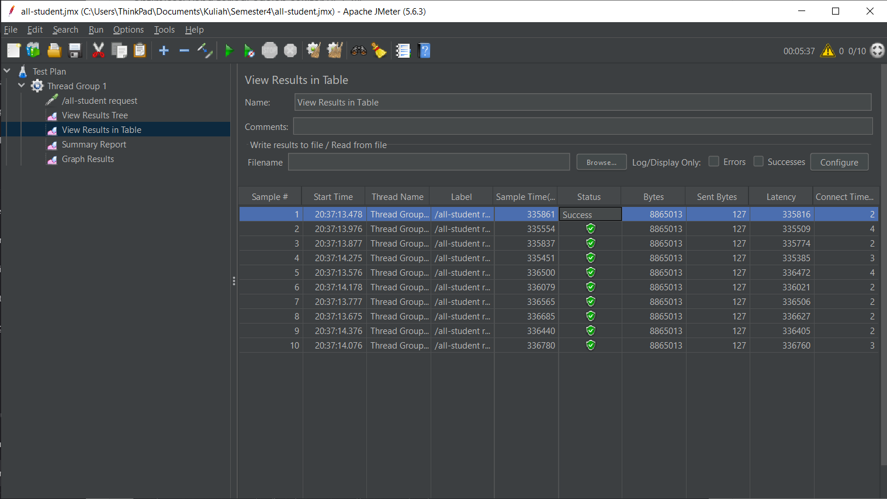
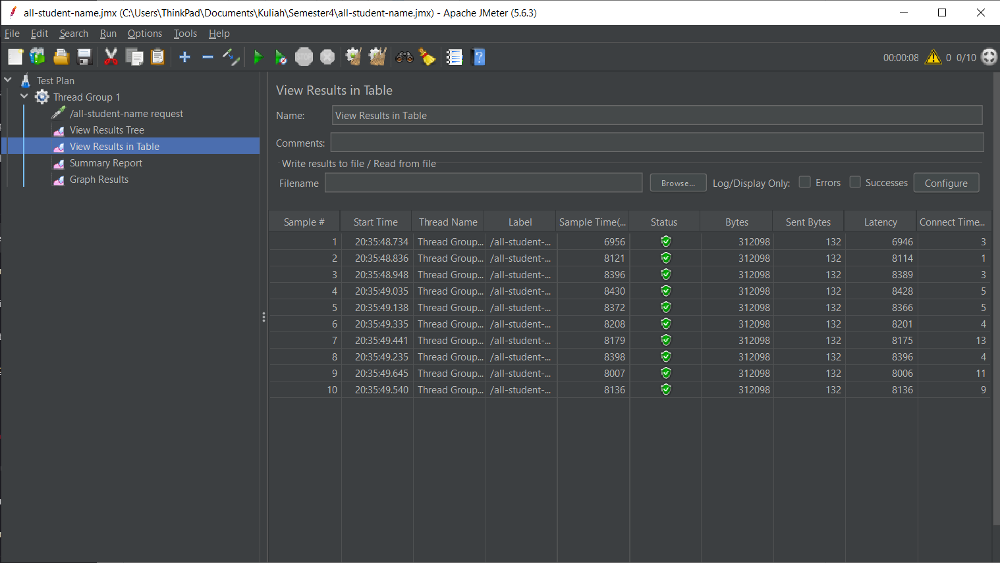
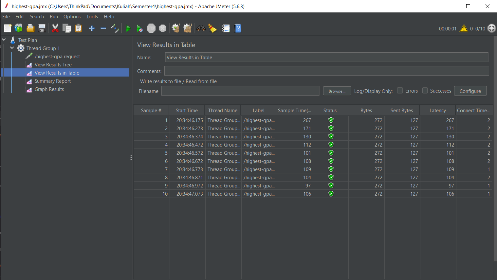

# Exercise Profiling Advance Programming

Nama: Wisnu Nugroho

NPM: 2306275084

Kelas: Prolan-A

# Modul 5 - Java Profiling

> What is the difference between the approach of performance testing with JMeter and profiling with IntelliJ Profiler in the context of optimizing application performance?

Dalam konteks performance testing, JMeter dan IntelliJ Profiler memiliki pendekatan testing yang berbeda. JMeter digunakan untuk pengujian kinerja dengan mensimulasikan beban pengguna guna mengidentifikasi bottleneck seperti waktu respons, throughput, dan skalabilitas sistem. Sementara itu, IntelliJ Profiler melakukan profiling pada level kode untuk menganalisis penggunaan CPU, memori, dan thread, membantu menemukan serta mengoptimalkan bagian kode yang tidak efisien dalam aplikasi.

> How does the profiling process help you in identifying and understanding the weak points in your application?

Profiling process membantu saya mengidentifikasi weak point dalam aplikasi melalui visualisasi perilaku runtime secara komprehensif. Saya dapat melihat CPU usage, memory consumption, dan execution time untuk menemukan bottleneck seperti slow methods, memory leak, atau inefficient algorithms. Berbekal informasi tersebut, saya dapat fokus melakukan optimization pada area yang sungguh membutuhkan optimasi/perbaikan, bukan hanya menebak-nebak bagian kode yang bermasalah.

> Do you think IntelliJ Profiler is effective in assisting you to analyze and identify bottlenecks in your application code?

Ya, menurut saya, IntelliJ Profiler sangat efektif dalam membantu menganalisis dan mengidentifikasi bottleneck dalam kode aplikasi. Tool ini menyediakan visualisasi yang jelas untuk penggunaan CPU, alokasi memori, eksekusi thread, dan pemanggilan fungsi. Saya dapat melihat bagian mana yang memakan waktu eksekusi paling lama, menggunakan banyak memori, dan menyebabkan perlambatan. Dengan data yang tersajikan dengan detail dan cara kerja analisis yang efisien, tool ini sangat membantu saya dalam meningkatkan performa aplikasi.

> What are the main challenges you face when conducting performance testing and profiling, and how do you overcome these challenges?

Salah satu tantangan utama yang saya hadapi dalam performance testing dan profiling adalah pengujian berskala besar membutuhkan waktu yang cukup lama di komputer saya. Untuk mengatasi hal ini, saya melakukan pengujian secara bertahap dengan menguji method secara individu terlebih dahulu sebelum menjalankan tes yang lebih besar. Selain itu, saya mengurangi jumlah data yang diproses selama pengujian untuk mempercepat analisis tanpa kehilangan informasi penting. Dengan pendekatan ini, saya dapat mengidentifikasi bottleneck dengan lebih cepat tanpa membebani sistem secara berlebihan.

> What are the main benefits you gain from using IntelliJ Profiler for profiling your application code?

Manfaat utama menggunakan IntelliJ Profiler adalah integrasi langsung dalam IDE yang mempercepat proses profiling. Dengan tool profiling yang terhubung langsung ke source code, saya dapat menemukan bottleneck dengan lebih mudah dan melakukan perbaikan tanpa perlu berpindah aplikasi. IntelliJ Profiler juga memudahkan perbandingan kinerja antar versi kode untuk memastikan perbaikan yang dilakukan benar-benar meningkatkan performa aplikasi.

> How do you handle situations where the results from profiling with IntelliJ Profiler are not entirely consistent with findings from performance testing using JMeter?

Apabila hasil profiling dengan IntelliJ Profiler tidak sepenuhnya konsisten dengan temuan dari performance testing menggunakan JMeter, saya akan menjalankan pengujian beberapa kali lagi untuk memastikan kestabilan hasil. Jika inkonsistensi masih terjadi, saya akan memeriksa konfigurasi pengujian guna mengidentifikasi perbedaan yang mungkin memengaruhi hasil. Namun, jika setelah verifikasi dan pengujian ulang perbedaan tetap ada, kemungkinan besar hal ini disebabkan oleh faktor eksternal di luar kendali saya, seperti kondisi sistem, latensi jaringan.

> What strategies do you implement in optimizing application code after analyzing results from performance testing and profiling? How do you ensure the changes you make do not affect the application's functionality?

Setelah menganalisis hasil performance testing dan profiling, saya menerapkan beberapa strategi optimasi sebagai berikut:

- Pada method `getAllStudentsWithCourse` saya menggunakan query langusng yang telah disediakan oleh Spring JPA untuk mengambil data student dengan course yang terkait. Dengan menggunakan query ini, saya mengurangi jumlah query yang dijalankan ke database (`findAll` student lalu `findCourseRepository` untuk setiap student), sehingga dapat mengurangi waktu eksekusi dan overhead yang terjadi.
- Membuat method baru `findStudentsWithHighestGpa` untuk mengambil data student dengan GPA tertinggi secara langsung dari database. Melakukan pemrosesan data langsung menggunakan query SQL ke database dapat mengurangi overhead yang terjadi daripada melakukannya di dalam aplikasi (select semua studentnya dulu lalu dicari yang tertinggi).
- Saya menggunakan `StringBuilder` untuk menggabungkan string pada method `joinStudentNames` daripada menggunakan string konkatenasi biasa. Hal ini dapat mengurangi overhead akibat pembuatan objek string baru setiap kali melakukan concatenation.

# Screenshoot Testing & Profiling

## Test Plan 1 (/all-students)

## Test Plan 2 (/all-students-name)

## Test Plan 3 (/highest-gpa)

